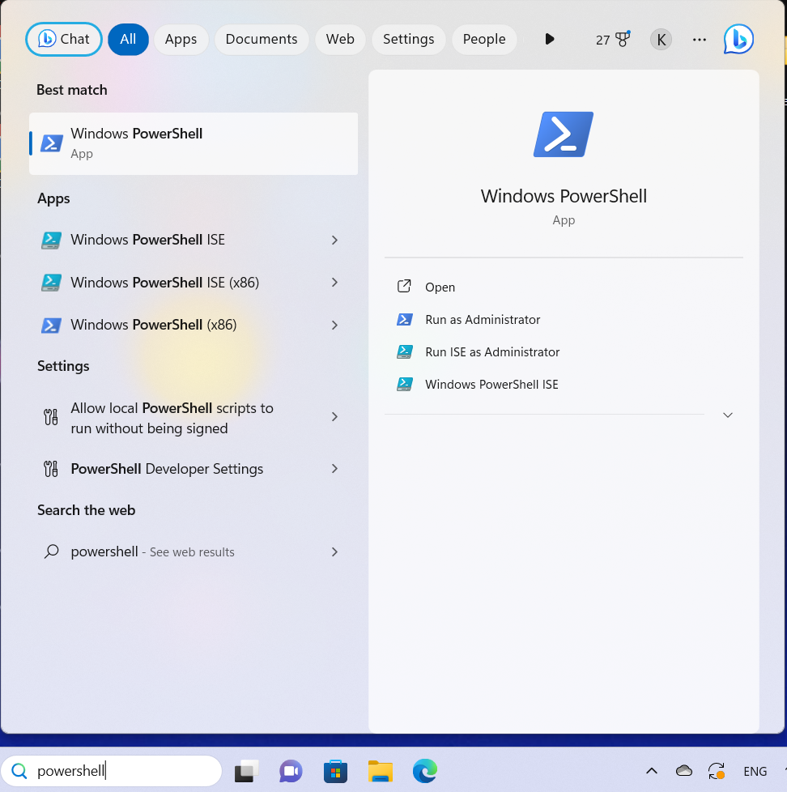
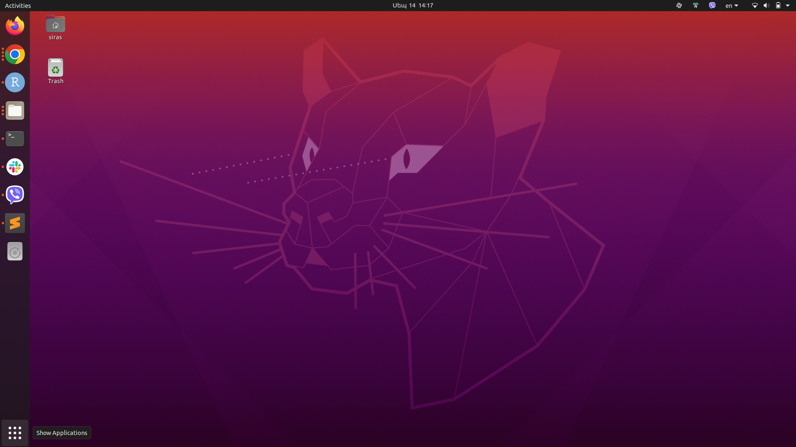
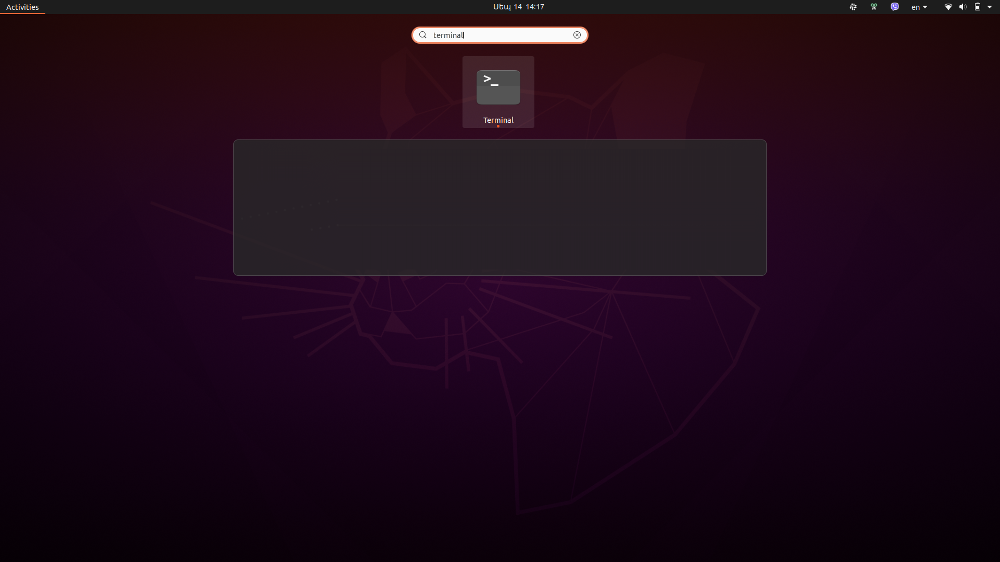
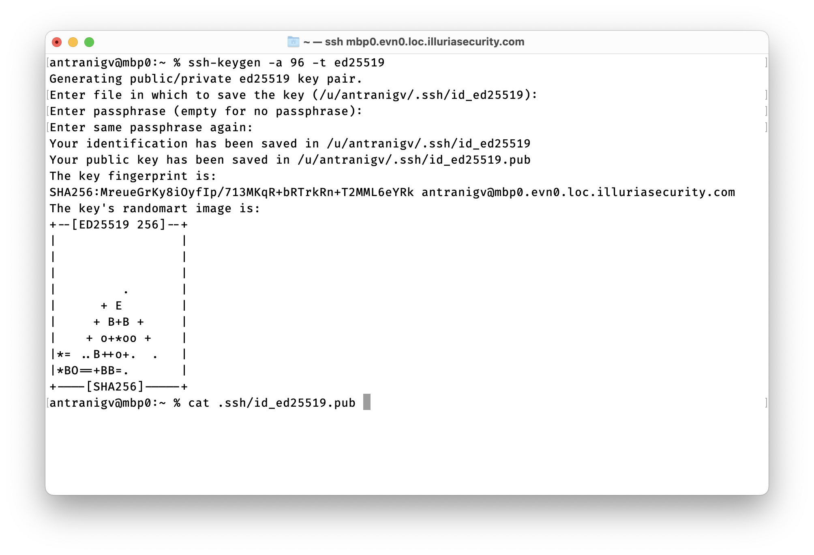

## Open your terminal

If you're using a Windows machine you can use PowerShell as a terminal



On a Unix machine (Linux, macOS, BSD) you can use a terminal emulator. Here's how open the Terminal on Ubuntu running Gnome





## Generate an SSH key

ABI servers do not authenticate with username/password, instead we use username and authentication keys. To generate an authentication key, you may run the following command in your console.

```
ssh-keygen -a 96 -t ed25519
```
After running the command, press Enter to accept the file name, leave the passphrase field blank, and press Enter two more times

You will get the following output



## Sharing your key

You may run `cat .ssh/id_ed25519.pub` to see your public key. Please share the public key with your system administrator.

### Private key location
You can find your private key in the ```C:\Users\user_name\.ssh``` folder in Windows OS

You can find your private key in the ```/home/user_name/.ssh``` folder in Unix OS

Please replace **user_name** in the path with your actual username

## Logging into a server

You may run

```
ssh -l yourusername nameofserver.abi.am
```

to log into the server.

